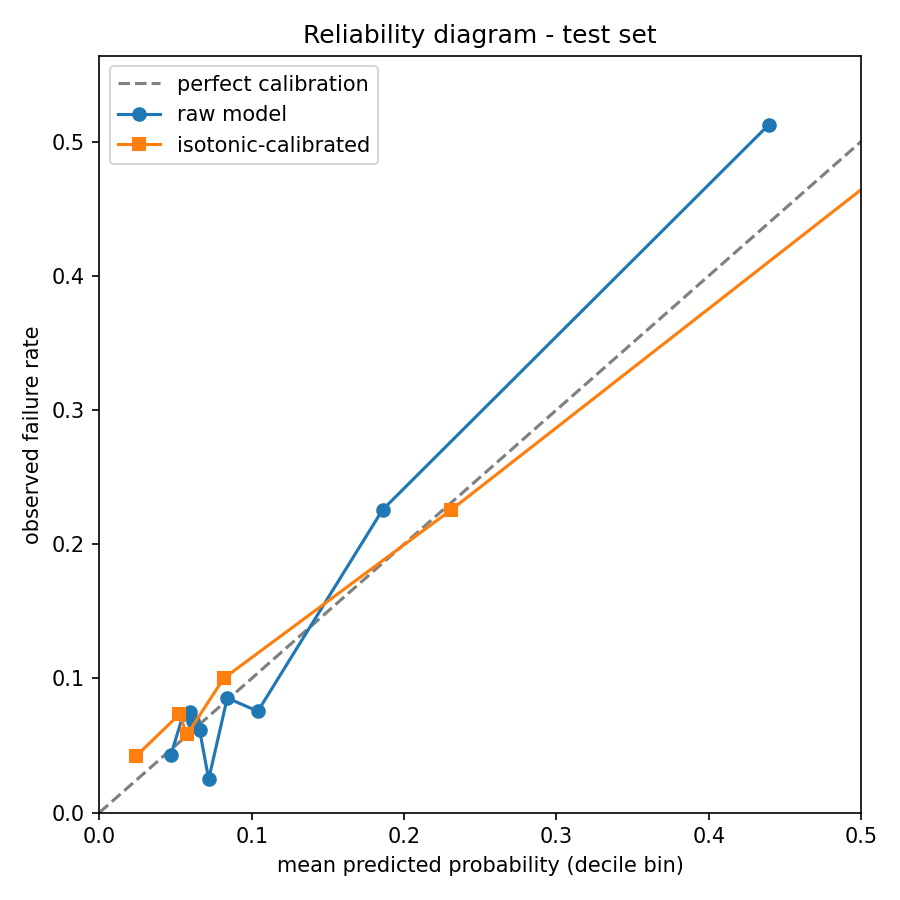
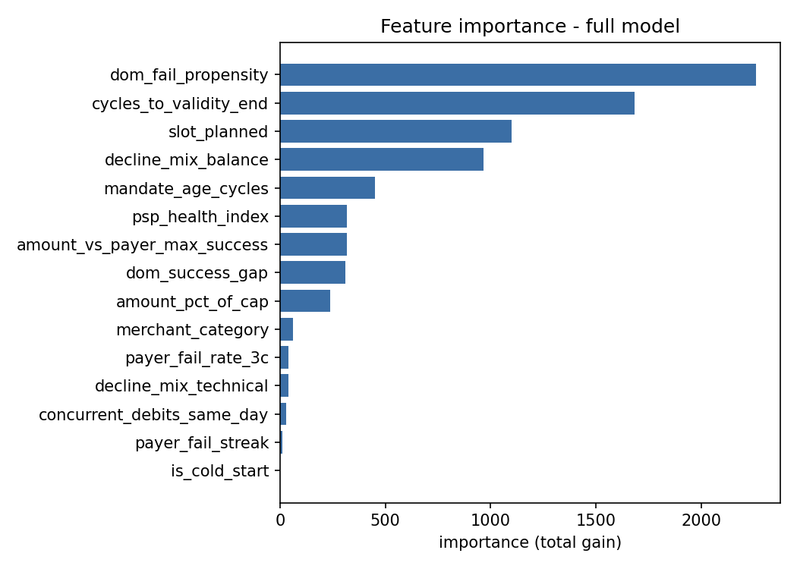
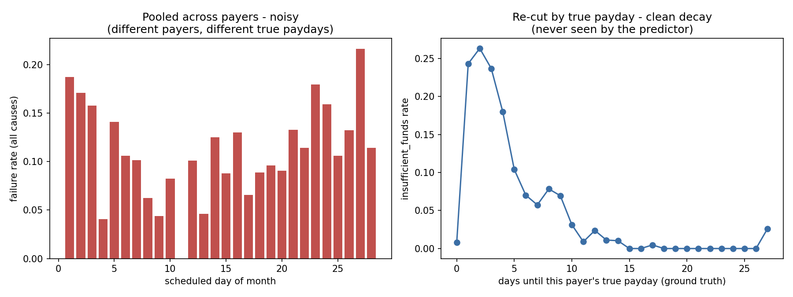
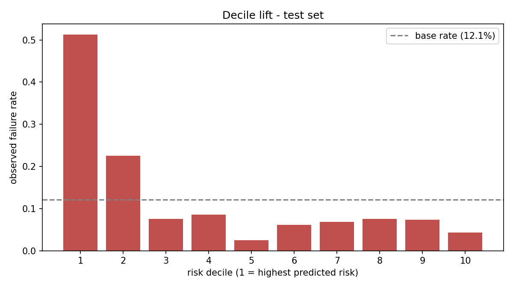
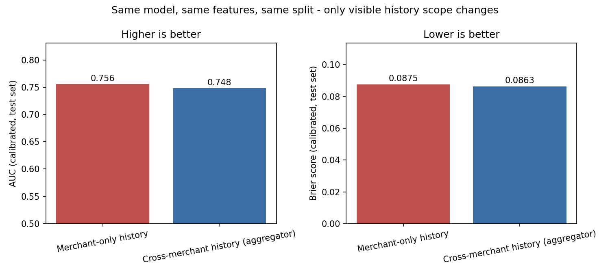

# Results

## Phase 1 — Predictor

All numbers below come from one real run: `python -m predictor.train` against
`data/observable/` generated by `python -m simulator.generate --seed 42
--payers 400 --cycles 6`. Nothing here is hand-adjusted; regenerating the data
and re-running training reproduces this section (seed 42 throughout — world
generation, the payer split, and the model itself).

Split sizes (payer-level, 60/20/20): **train 5,011 rows / calibration 1,720
rows / test 1,618 rows**, drawn from 400 payers with no payer appearing in
more than one split.

### Model comparison (test set, n=1,618)

| Model | AUC | Brier |
|---|---|---|
| Trivial (population base rate) | 0.5000 | 0.1088 |
| Single-feature (`payer_fail_streak` only, logistic regression) | 0.5685 | 0.1073 |
| **Full model (LightGBM, raw)** | **0.7504** | **0.0870** |
| **Full model (calibrated)** | 0.7484 | **0.0863** |

The full model clearly beats both baselines on both metrics. It also beats the
single-feature baseline by a wide margin (AUC +0.18, Brier −0.02) — the
comparison the working method asked to be reported honestly either way; here
it favours the full feature set.

The tiny AUC dip after calibration (0.7504 → 0.7484) is expected and
harmless: isotonic regression is a step function, so it can introduce ties
between scores that were previously distinct, which very slightly reduces
AUC's ability to rank those tied pairs. Brier score — the metric that
actually matters once the policy engine multiplies probabilities by rupees —
improves after calibration, which is the metric calibration is for.

### Calibration

| | Raw | Calibrated |
|---|---|---|
| AUC (test) | 0.7504 | 0.7484 |
| Brier (test) | 0.0870 | 0.0863 |
| Expected calibration error (test) | 0.0237 | **0.0140** |

Method: isotonic regression, fit on the calibration payer split (1,720 rows,
~80 payers), evaluated on the untouched test split. See
`predictor/calibrate.py` for why isotonic was chosen over Platt scaling.

Six quantile bins (deciles collapsed where raw scores repeated). The
calibrated curve sits closer to the diagonal across the range; the largest
remaining gap is in the top bin (predicted 0.60, observed 0.55, n=144) —
the highest-risk 9% of test rows, where 144 observations is the least stable
slice in the whole diagnostic. `tests/test_calibration.py` asserts ECE stays
under 0.05 on any re-run; 0.014 is well inside that.

### Temporal holdout (sanity check, not a headline number)

Train on cycles ≤4 (n=5,818, all payers), evaluate on cycles 5–6 (n=2,531,
same payers): **AUC 0.7928, Brier 0.0769**.

This number is higher than the payer-holdout test AUC (0.7504), and that gap
is itself informative rather than a discrepancy to explain away: the temporal
split shares payers between train and holdout, so some of the lift is the
model recognising a specific payer's own recent history rather than
generalising the underlying pattern. **The payer-level split above is the
honest out-of-sample estimate.** This section exists only to confirm
performance does not collapse moving forward in time, which it does not — see
CLAUDE.md's own framing of this check as a sanity check, not a result.

### Feature importance

| Feature | Gain | Rank |
|---|---|---|
| `dom_fail_propensity` | 2,261.7 | 1 |
| `cycles_to_validity_end` | 1,685.7 | 2 |
| `slot_planned` | 1,098.3 | 3 |
| `decline_mix_balance` | 965.9 | 4 |
| `mandate_age_cycles` | 451.0 | 5 |
| `psp_health_index` | 317.5 | 6 |
| `amount_vs_payer_max_success` | 316.9 | 7 |
| `dom_success_gap` | 309.1 | 8 |
| `amount_pct_of_cap` | 239.1 | 9 |
| `merchant_category` | 60.0 | 10 |
| `payer_fail_rate_3c` | 40.9 | 11 |
| `decline_mix_technical` | 38.5 | 12 |
| `concurrent_debits_same_day` | 29.9 | 13 |
| `payer_fail_streak` | 12.6 | 14 |
| `is_cold_start` | 0.0 | 15 |

**What the model actually learned — reported honestly, both the confirming
and the surprising parts.**

`dom_fail_propensity` ranks first by a wide margin. As computed, it pools a
payer's history across every merchant they hold, and it was built without
ever seeing the payer's true payday, only their outcome history — the
day-of-month diagnostic below confirms the underlying signal it is chasing is
real and strong. Ranking #1 is evidence the feature *itself* is doing real
work. It is **not**, on its own, evidence that the *cross-merchant scope* is
what makes it work rather than any strong per-payer signal a narrower view
could also approximate — that is a separate, more specific question, tested
directly in the "Cross-merchant ablation" section below. Read that section
before treating this ranking as the aggregator argument settled: the measured
answer is more qualified than this ranking alone suggests.

`concurrent_debits_same_day` — the other feature named in CLAUDE.md section
10 as carrying the aggregator argument — ranks 13th out of 15, with weak
gain. This was checked rather than assumed: the univariate failure rate by
concurrent-debit count is essentially flat (12.3% at 0, 13.1% at 1, 9.3% at
2, the last on only 129 rows) and its correlation with `dom_fail_propensity`
is near zero (−0.03), so it is not simply redundant with the stronger
feature — it appears to carry little independent signal in this calibrated
world. A plausible mechanism: same-day collisions matter causally (Phase 0's
ledger genuinely lets the first debit through starve the second), but which
of two same-day debits goes first is effectively arbitrary (ascending
`mandate_id`, an assumption documented in Phase 0's `ASSUMPTIONS.md`) — and
in production the presentation order among simultaneous debits is genuinely
arbitrary too, so this weak-signal finding may not be a simulator artifact at
all. Logged as a known limitation in `docs/ASSUMPTIONS.md` §9c rather than
regenerated away. The claim that *both* named features would rank high did
not hold, and is reported here rather than adjusted away.

`is_cold_start` shows exactly zero gain — the tree never split on it. This
appears to be a real finding about the chosen cold-start strategy rather than
a bug: because six payer-derived features (`payer_fail_streak`,
`payer_fail_rate_3c`, `dom_fail_propensity`, `dom_success_gap`,
`decline_mix_balance`, `decline_mix_technical`) are all simultaneously `NaN`
exactly when a payer is cold-start, LightGBM's missing-value routing on any
one of those columns already isolates the same rows. The explicit flag turned
out to be redundant with the missingness pattern itself — a legitimate
argument for "missing indicator, let the tree route it" being sufficient on
its own, without needing a second explicit signal. Cold-start rows do differ
in outcome (14.2% failure rate vs 12.3% for rows with history), so the model
is not ignoring them; it is just reaching that distinction through the NaN
pattern rather than through the flag.

`cycles_to_validity_end` ranks second, higher than intuition might suggest
for a field that sounds like bookkeeping. It is plausible signal, not noise:
a mandate close to its validity end is mechanically more likely to hit
`mandate_expired`, one of the four terminal decline codes, so this feature is
partly standing in for expiry risk specifically. `slot_planned` at rank 3 is
expected and by design — presentation in the restricted peak window carries
in an 18% technical decline rate in the world model (config:
`slots.peak_restricted.restricted_decline_rate`), the single largest planted
effect of any lever in the simulator, so the model finding it immediately is
confirmation the pipeline works, not a surprise.

### Day-of-month signal (verification, ground truth used only for validation)

Left: raw failure rate by scheduled day-of-month, pooled across all 400
payers — noisy (0% at some days, 22% at others), because payers with
different true paydays are mixed together and several days have under 50
observations. Right: `insufficient_funds` rate by *true* days-until-payday,
using the hidden `income_day` ground truth *only* for this one-time
validation plot (`scripts/day_of_month_diagnostic.py`, which lives outside
`predictor/` for exactly this reason — see its docstring). Clean, monotonic
decay: 24.3% at 1 day out, 26.3% at 2 days, down to under 1% from 11 days out
through 26, before rising again near the wraparound. Visible, not flat, not a
cliff — the shape the day-of-month feature is built to recover without ever
seeing the number that produces it.

### Threshold

No classification threshold appears anywhere in `predictor/`. Precision and
recall are reported at four illustrative cuts (0.1, 0.2, 0.3, 0.5) purely as
diagnostics in `predictor/train.py::evaluate` — none of them is selected as
an operating point. The threshold is derived in Phase 2 from the
expected-value formula.

### Decile lift table

Phase 2's expected-value formula multiplies `p_fail` by a rupee amount, and
whether intervention ever clears its cost depends entirely on how
*concentrated* risk is at the top of the distribution — not on the ~12.4%
overall base rate. This table exists so Phase 2's cost parameters
(`config/policy.yaml`) get set against a measured number, not a guess.
Ranking is by raw model score (more distinct values than the calibrated
step-function output); the probability shown per bin is the calibrated one.

| Decile (1 = highest risk) | n | Mean predicted | Observed rate | Lift vs base rate |
|---|---|---|---|---|
| 1 | 160 | 0.559 | **51.3%** | **4.13×** |
| 2 | 164 | 0.188 | 22.6% | 1.82× |
| 3 | 159 | 0.082 | 7.5% | 0.61× |
| 4 | 164 | 0.068 | 8.5% | 0.69× |
| 5 | 161 | 0.058 | 2.5% | 0.20× |
| 6 | 162 | 0.058 | 6.2% | 0.50× |
| 7 | 161 | 0.057 | 6.8% | 0.55× |
| 8 | 160 | 0.052 | 7.5% | 0.60× |
| 9 | 164 | 0.052 | 7.3% | 0.59× |
| 10 | 163 | 0.024 | 4.3% | 0.35× |

**Reading it plainly:** risk is sharply concentrated in the top ~20% of
mandates. Decile 1 fails at 51.3% — over four times the base rate — which is
comfortably high enough for a targeted intervention's expected value to clear
a small notification/retry cost. Decile 2 still sits meaningfully above base
rate (22.6%, 1.82×). From decile 3 downward, observed rates cluster near or
below the base rate with some non-monotonic noise between adjacent deciles
(e.g. decile 5's 2.5% sitting below decile 4's 8.5% and decile 6's 6.2%) —
expected at ~160 rows per bin and an AUC of 0.75, not a sign of a broken
ranking. The practical read for Phase 2: the model separates a genuinely
actionable top slice from a long, comparatively flat tail, rather than
producing a smooth gradient across the whole population — cost parameters
should be set knowing that "high risk" in this model means roughly the top
20%, not a wide band.

### Cross-merchant ablation — the aggregator argument, measured

CLAUDE.md section 3 claims this prediction can only be built at the
aggregator layer. `dom_fail_propensity` ranking #1 in feature importance
(above) is suggestive of that, not proof — it shows the feature is useful, not
that the *cross-merchant scope* is what makes it useful. This section tests
that directly: the identical model, identical hyperparameters, identical
payer split (same seed, so train/calibration/test contain the exact same
payers both times), trained twice on the identical feature *names* —
once scoped to a payer's history across every merchant they hold
(`scope="cross_merchant"`, the real pipeline), and once re-scoped to what a
single merchant's own book alone could see (`scope="merchant_only"`, an
ablation implemented as one parameter in `predictor/features.py`; see
`predictor/ablation.py`). The only thing that differs between the two numbers
below is how much of the network a party is allowed to see.

**The result did not confirm the thesis, and this section says so directly
rather than around it.**

| Model | AUC (calibrated) | Brier (calibrated) | n |
|---|---|---|---|
| Merchant-only history | 0.7558 | 0.0875 | 1,618 |
| Cross-merchant history (aggregator) | 0.7484 | 0.0863 | 1,618 |

The point estimate favours *merchant-only* on AUC — the wrong direction for
the pitch — and favours the aggregator only marginally on Brier (0.0863 vs
0.0875). Neither is a large gap. A paired bootstrap over the test set (2,000
resamples, same resampled rows scored by both models) puts a 95% CI on the
AUC gap at **[-0.038, +0.024]** — it crosses zero, and 33% of resampled draws
actually favour the aggregator direction. **At this sample size, the two
scopes are not statistically distinguishable.**

To give the aggregator scope its best possible shot, a subgroup was checked
specifically where cross-merchant information should matter most: rows where
the *mandate itself* is brand new (no history of its own under merchant-only
scope) but the *payer* already has history through other merchants under
cross-merchant scope — exactly "a new subscription for a payer we already
know," the scenario CLAUDE.md section 3 describes. n=216, cross_merchant AUC
0.557 vs merchant_only AUC 0.568 — no advantage there either, though a
216-row subgroup is itself too small to read much into on its own.

**What likely happened, mechanically.** `dom_fail_propensity`'s cross-merchant
version pools a ±3-day window across *all* of a payer's mandates and shrinks
it toward that payer's *overall* rate across every merchant. For a mature
monthly mandate, its own `debit_day_of_month` never changes — every one of
its own past presentations landed on (almost exactly) the same day, so that
mandate's own repeat history is an unusually clean, low-noise predictor of
its own future outcome on that day. The cross-merchant version, by pooling in
nearby-but-different days from *other* mandates and shrinking toward a
broader payer-wide average, can dilute that precise same-day signal rather
than adding to it. Under merchant-only scope, a mandate's history and its
day-of-month window collapse onto the *same* narrow, high-precision quantity
by construction — which is a plausible reason merchant-only performed as well
as it did, not evidence that cross-merchant data is worthless.

**What this does and does not mean for the aggregator argument.** It does not
mean a single merchant can rebuild this system — CLAUDE.md section 3's claim
is about which *data* is visible to whom (cross-merchant payer history,
decline-code mix, PSP health in aggregate, full attempt-level history across
every merchant), and that visibility gap is a fact about the world, not
something this one measurement can undo. What it does mean, honestly: *this
specific feature design*, at *this dataset scale* (400 payers, 6 cycles), does
not yet turn that visibility advantage into a measurably better prediction
than a strong single-merchant baseline built on repeat-mandate autocorrelation
alone. That is a real, reportable finding about where the current
implementation stands — not a result to route around. The originally planned
README headline ("same model, same features... 0.748 vs merchant-only") is
**not supported by this measurement and will not be used.** See
`docs/FAILURES.md` #8 for the full account, and the module docstring of
`predictor/ablation.py` for how to re-run this check after any future feature
or data change.

### Additive cross-merchant test — pre-registered before running

The first ablation tested "does *replacing* clean same-mandate history with a
blended cross-merchant view help?" and found no measurable advantage. That is
not the claim CLAUDE.md section 3 actually makes. Section 3's claim is that
the aggregator sees things a merchant cannot — an additive claim, not a
substitution claim. The correct test is: does *adding* other-merchant
information on top of the same-mandate signal beat the same-mandate signal
alone? The first ablation's confound (blending diluted a clean signal) does
not bear on this question either way, so this is a genuinely new test, not a
second attempt at the same one.

**Hypothesis.** A model with both same-mandate history and other-merchant
history beats a model with same-mandate history alone.

**Feature spec, fixed before running:**
- **Model A (baseline):** the existing `merchant_only`-scope feature set,
  unchanged (15 columns including `is_cold_start`).
- **Model B (augmented):** Model A's columns, plus two new columns:
  - `dom_fail_propensity_other_merchants` — the identical formula as the
    existing `dom_fail_propensity` (±3-day window, shrinkage toward the
    same source payer's own overall rate, `alpha=3.0`), computed from
    *only* this payer's history through *other* merchants — this mandate's
    own merchant excluded entirely. `NaN` if the payer has no history from
    any other merchant yet.
  - `concurrent_debits_same_day_other_merchants` — the standard
    cross-merchant `concurrent_debits_same_day` value. Already inherently an
    other-merchants-only signal (a payer holds one mandate per merchant, so
    "another mandate landing the same day" already means "another
    merchant"), reused unchanged rather than recomputed.
- Same LightGBM hyperparameters (`num_leaves=7`, `learning_rate=0.05`,
  `min_child_samples=40`), same payer split (seed 42), same calibration
  procedure as every other model in this document.

**Decision rule, fixed before running.** Compare calibrated test-set AUC and
Brier, A vs B. Compute a paired bootstrap 95% CI (2,000 resamples, same
methodology as the first ablation) on the AUC gap (B − A). CI excludes zero in
B's favour → the additive hypothesis is supported. CI crosses zero, or favours
A → report as a second null result, next to the first, and stop. One run. No
hyperparameter or feature-design change is made after seeing the result.

**Result — run once, reported as it landed:**

| Model | AUC (calibrated) | Brier (calibrated) | n |
|---|---|---|---|
| A: merchant-only (same-mandate history) | 0.7558 | 0.0875 | 1,618 |
| B: A + other-merchants columns (additive) | 0.7410 | 0.0878 | 1,618 |

Gap (B − A): AUC **−0.0148**, Brier −0.0003. The point estimate runs *against*
the additive hypothesis this time — adding the two other-merchants columns
made the model very slightly worse on both metrics, not better. Bootstrap 95%
CI on the AUC gap (2,000 resamples): **[-0.035, +0.007]** — crosses zero, and
this time does not even meaningfully favour B at either end. Coverage of the
new `dom_fail_propensity_other_merchants` column was 94.2% on the test set
(most payers have at least one other merchant with prior history by the time
of a given test-set row), so the null result is not simply an artifact of the
new feature being mostly missing.

**Verdict, per the pre-registered decision rule: not supported. Second null
result, reported next to the first, with no further iteration.** Neither
substituting cross-merchant history for same-mandate history (first
ablation) nor adding it alongside same-mandate history (this test) produced
a measurable predictive improvement in this dataset, at this scale.

**What this rules in and out.** It does not mean the other-merchants columns
carry zero information in any absolute sense — a small negative point
estimate on two added columns is also consistent with them adding pure noise
that the model (correctly, given `min_child_samples=40` and a ~5,000-row
training set) mostly ignores, at a small cost from the extra split
candidates diluting tree search slightly. It rules out the more specific,
useful claim this test set out to check: that cross-merchant information
measurably improves *this* model's predictions at *this* data scale. A
much larger payer population (the eventual production scale this system is
argued for) is the honest place to look for this effect if it exists and is
simply too small to detect in a 400-payer synthetic world — not a hyperparameter
search on the same data, which is exactly the line this test was designed not
to cross.

**Consequently, the aggregator argument in this project is reframed on
actuation, not prediction.** CLAUDE.md section 3's claim was never only about
predictive power — it names two things a merchant cannot do: see the payer
across merchants, *and* control the timing levers. Both ablations test only
the first half, and neither found a measurable effect at this scale. The
second half is not a measurement that could flip either way — it is a
regulatory and structural fact, true independent of any model's AUC: a single
merchant cannot choose when its own PDN is sent relative to a payer's other
obligations in a way that accounts for them, cannot select an execution slot
network-wide, and cannot allocate a shared retry budget across mandates it
does not itself hold. Razorpay does all three by construction of its role.
**The aggregator advantage this system demonstrates is in what it can *do*
with a risk score, not in producing a materially better risk score than a
well-built single-merchant baseline could.** That framing survives both null
results completely and rests on facts this project does not need to
re-measure to defend.

### Model artifact

Saved to `data/model/` (gitignored, regenerable): LightGBM booster
(`model.txt`), isotonic calibrator (`calibrator.joblib`), and metadata
(`metadata.json`) recording the feature list, categorical levels, best
iteration (71), and a content hash. Version string: `0.1.0+86f167d2` — this
changes if the booster, calibrator, or feature list changes, so every
`DecisionRecord` in Phase 4 can be traced back to the exact model that
produced it.
